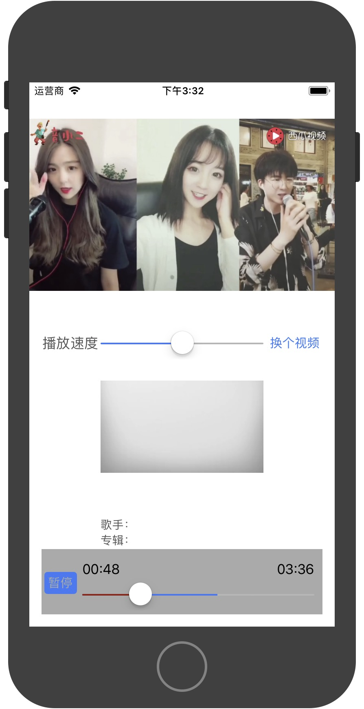

## AVPlayer打造一个iOS原生音、视频播放器

要实现的功能：

`播放`、`暂停`、`选时播放(快进快退)`、`缓冲`、`播放时长`、`音频信息获取`、`视频首帧获取`、`视频更换`、`播放速度调节`

上一个粗糙的效果图



也是一款网络播放器，可播放本地与网络的资源，直播拉流暂不支持RTMP协议；如若需要支持RTMP协议，请转到B站的开源[https://github.com/Bilibili/ijkplayer](https://github.com/Bilibili/ijkplayer)

#### 基础播放需要的类

> * **NSURL** 支持 `本地文件url` 和 `网络的url`
> * **AVPlayerItem** 通过 `URL` 初始化的一个播放对象（状态获取）
> * **AVPlayer** 通过 `AVPlayerItem` 初始化的播放控制器（控制）
> * **AVPlayerLayer** 通过 `AVPlayer `初始化的一个播放展示视图（展示）


需要监听的 `AVPlayerItem ` 属性

|监听的属性|作用|备注|
|:------:|:------:|:------|
|status | 播放器状态变化 |比如准备完成后可获得播放时长、音频专辑、歌手，视频首帧图像等|
|loadedTimeRanges | 缓冲进度 |用于展示当前缓冲的进度|
|playbackBufferEmpty | 缓冲区空了|需要等待、加载数据|
|playbackLikelyToKeepUp | 缓存足够播放|加载完成获取到足够播放的数据|


需要监听的通知

|监听的属性|作用|
|:------:|:------:|
|UIDeviceOrientationDidChangeNotification|设备方向旋转（全屏使用）|
|AVPlayerItemDidPlayToEndTimeNotification|播放完成|
|AVPlayerItemFailedToPlayToEndTimeNotification|异常中断|
|AVPlayerItemPlaybackStalledNotification|播放失败|
|AVAudioSessionInterruptionNotification|声音被打断（来电话了）|
|AVAudioSessionRouteChangeNotification|耳机插入、拔出|
|UIApplicationWillResignActiveNotification|程序进入后台|
|UIApplicationDidBecomeActiveNotification|程序进入前台|


#### 1.音视频播放创建

只需要依次创建 `基础播放需要的类` 即可，如下：(url支持**音频**、**视频**，**本地**与**网络**的皆可)

```
NSURL* fileUrl = [NSURL fileURLWithPath:@"Desktop/三国演义.mp4"];
self.playerItem = [AVPlayerItem playerItemWithURL:fileUrl];
self.player = [AVPlayer playerWithPlayerItem:self.playerItem];

// 如果是视频，需要初始化一个展示的layer
self.playerLayer = [AVPlayerLayer playerLayerWithPlayer:self.player];
self.playerLayer.backgroundColor = [UIColor blackColor].CGColor;
self.playerLayer.frame = CGRectMake(0, 0, self.view.frame.size.width, 300);//需要给一个初始值
[self.view.layer addSublayer:self.playerLayer ];

```

给`AVPlayerItem` 添加完KVO之后就可以进行下一步了！

#### 2.音视频信息获取

##### 2.1 监听 `AVPlayerItem` 的 `status ` 属性

可以实时捕捉到状态变化，当 `status ` 为 `AVPlayerStatusReadyToPlay` 的时候，开始获取媒体信息：

* 音频、视频可获取到播放总时长
总时长 `self.playerItem.duration` 是个结构体，可以转换成时间，如下：

```
CGFloat duration = CMTimeGetSeconds(self.playerItem.duration);
```

* 视频可获取到首帧图像（播放器准备好之后默认自动显示），如下：

```
// 获取视频第一帧
-(UIImage*)getVideoPreView{

    AVAssetImageGenerator *assetGen = [[AVAssetImageGenerator alloc] initWithAsset:self.playerItem.asset];
    assetGen.appliesPreferredTrackTransform = YES;
    CMTime time = CMTimeMakeWithSeconds(0.0, 600);
    NSError *error = nil;
    CMTime actualTime;
    CGImageRef image = [assetGen copyCGImageAtTime:time actualTime:&actualTime error:&error];
    UIImage *videoImage = [[UIImage alloc] initWithCGImage:image];
    CGImageRelease(image);
    return videoImage;
}
```

* 视频可获取到视频大小，如下：
 
```
CGRect frame = self.playerLayer.videoRect;
```

* 音频可获取到歌曲名、专辑、歌手、缩略图，如下：

标准格式的音频都可以获取到的，方法有点绕

```
    AVAsset* asset = self.playerItem.asset;
    NSString *title = @"";
    UIImage* image = nil;
    NSString *artist = @"";
    NSString *albumName = @"";
    
    for (NSString *format in [asset availableMetadataFormats]) {
        
        for (AVMetadataItem *metadataItem in [asset metadataForFormat:format]) {

            if ([metadataItem.commonKey isEqualToString:@"artwork"]) {
                if ([metadataItem.value isKindOfClass:[NSData class]]) {
                    NSData *data = (NSData *)metadataItem.value;
                    image = [UIImage imageWithData:data];
                }
                
            }else if([metadataItem.commonKey isEqualToString:@"title"]){
                title = (NSString *)metadataItem.value;
                NSLog(@"title: %@",title);
                
            }else if([metadataItem.commonKey isEqualToString:@"artist"]){
                artist = (NSString *)metadataItem.value;
                NSLog(@"artist: %@",artist);
                
            }else if([metadataItem.commonKey isEqualToString:@"albumName"]){
                albumName = (NSString *)metadataItem.value;
                NSLog(@"albumName: %@",albumName);
                
            }
        }
    }
```

##### 2.2 监听 `AVPlayerItem` 的 `loadedTimeRanges ` 属性

可是捕捉到音视频加载进度，在

```
-(void)observeValueForKeyPath:(NSString *)keyPath ofObject:(id)object change:(NSDictionary<NSKeyValueChangeKey,id> *)change context:(void *)context
```

方法中 `change` 参数包含里具体信息，获取加载进度方法如下：

```
NSArray* ranges = change[@"new"];
if ([ranges isKindOfClass:[NSArray class]] && ranges.count > 0) {

	CMTimeRange range = [[ranges firstObject] CMTimeRangeValue];
	CMTime bufferDuration = CMTimeAdd(range.start, range.duration);
	NSLog(@"缓冲进度%f", CMTimeGetSeconds(bufferDuration));
}
```

##### 2.3 监听 `AVPlayerItem` 的 `playbackBufferEmpty ` 属性
缓冲开始

##### 2.4 监听 `AVPlayerItem` 的 `playbackLikelyToKeepUp ` 属性
缓冲结束

#### 3.音视频控制

通过 `AVPlayer ` 去控制，此例中的`self.player`

* 播放 

```
[self.player play];
```

* 暂停

```
[self.player pause];
```

* 选时播放(快进快退)

```
- (void)seekToTime:(CMTime)time completionHandler:(void (^)(BOOL finished))completionHandler
```

参数是个结构体，需要先构造一个，具体实现方式：

```
//	 选定到30秒处播放
    CMTime time = self.player.currentTime;
    time.value = 30 * time.timescale;
    [self.player seekToTime:time completionHandler:^(BOOL finished) {
        NSLog(@"seek到 %f 位置", self.player.currentTime);
    }];
```

* 视频切换

应用场景比较多，比如**播放小广告视频**(一般都是连续播好几个广告视频)、**连续播放视频**

```
[self.player replaceCurrentItemWithPlayerItem:self.playerItem];
```

* 播放速度调节

`rate` 为0时是暂停，1为正常速度，超过2之后视频会卡住，音频会保持当前 `rate` 值的播放速度

```
self.player.rate = 1; 
```

#### 4.音视频UI展示

需要一个定时器去实时更新UI状态变化，可以用 `NSTimer` 或者 `CADisplayLink`，具体可参照[Demo](https://github.com/yhl714387953/ZYPlayer)

---
感谢您阅读完毕，如有疑问，欢迎添加QQ:714387953(蜗牛上高速)。
[https://github.com/yhl714387953/ZYPlayer](https://github.com/yhl714387953/ZYPlayer)
如果有错误，欢迎指正，一起切磋，共同进步
如果喜欢可以Follow、Star、Fork，都是给我最大的鼓励。
